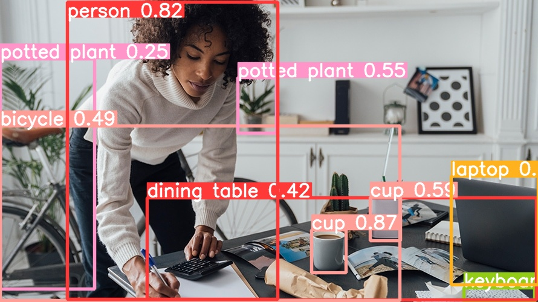

copyright @ DEPA MSU 2023 | Public

# YoloV8-Silva || [YouTube](https://www.youtube.com/watch?v=hg4oVgNq7Do)

The most recent and cutting-edge `YOLO` model, `YoloV8`, can be utilized for applications including object identification, image categorization, and instance segmentation. `Ultralytics`, who also produced the influential `YOLOv5` model that defined the industry, developed `YOLOv8`. Compared to `YOLOv5`, `YOLOv8` has a number of architectural updates and enhancements.


## Silva-Flow

We are simply using `YOLO` models in a python environment with opencv on `Windows`, `Mac` or `Linux` system. It can be imported from the ultralytics module

Two example codes were defined for the module
`yolov8_basics.py` and `yolov8_n_opencv.py`


> **Note**
>
> Install requirements.txt file in a Python>=3.7.0 environment, including PyTorch>=1.7

## Installation

```bash
pip install -r requirements.txt
```

> **Note**
>
> Link to official  [`YoloV8 GitHub page`](https://github.com/ultralytics/ultralytics). 


## Using `yolov8_basics.py`

```python
python yolov8_basics.py
```




## Using `yolov8_n_opencv.py`

`Use YoloV8 is an OpenCV way`. Have control over detection on each frame and choose what happens per detection.

```python
python yolov8_n_opencv.py
```

## Code | `yolov8_n_opencv.py` |


```python

import numpy as np
import cv2
from ultralytics import YOLO
import random

# opening the file in read mode
my_file = open("utils/coco.txt", "r")
# reading the file
data = my_file.read()
# replacing end splitting the text | when newline ('\n') is seen.
class_list = data.split("\n")
my_file.close()

# print(class_list)

# Generate random colors for class list
detection_colors = []
for i in range(len(class_list)):
    r = random.randint(0,255)
    g = random.randint(0,255)
    b = random.randint(0,255)
    detection_colors.append((b,g,r))

# load a pretrained YOLOv8n model
model = YOLO("weights/yolov8n.pt", "v8") 

# Vals to resize video frames | small frame optimise the run 
frame_wid = 640
frame_hyt = 480

# cap = cv2.VideoCapture(1)
cap = cv2.VideoCapture("inference/videos/afriq0.MP4")

if not cap.isOpened():
    print("Cannot open camera")
    exit()

while True:
    # Capture frame-by-frame
    ret, frame = cap.read()
    # if frame is read correctly ret is True

    if not ret:
        print("Can't receive frame (stream end?). Exiting ...")
        break

    #  resize the frame | small frame optimise the run 
    # frame = cv2.resize(frame, (frame_wid, frame_hyt))

    # Predict on image
    detect_params = model.predict(source=[frame], conf=0.45, save=False)

    # Convert tensor array to numpy
    DP = detect_params[0].numpy()
    print(DP)

    if len(DP) != 0:
        for i in range(len(detect_params[0])):
            print(i)

            boxes = detect_params[0].boxes
            box = boxes[i]  # returns one box
            clsID = box.cls.numpy()[0]
            conf = box.conf.numpy()[0]
            bb = box.xyxy.numpy()[0]

            cv2.rectangle(
                frame,
                (int(bb[0]), int(bb[1])),
                (int(bb[2]), int(bb[3])),
                detection_colors[int(clsID)],
                3,
            )

            # Display class name and confidence
            font = cv2.FONT_HERSHEY_COMPLEX
            cv2.putText(
                frame,
                class_list[int(clsID)]
                + " "
                + str(round(conf, 3))
                + "%",
                (int(bb[0]), int(bb[1]) - 10),
                font,
                1,
                (255, 255, 255),
                2,
            )

    # Display the resulting frame
    cv2.imshow('ObjectDetection', frame)

    # Terminate run when "Q" pressed
    if cv2.waitKey(1) == ord('q'):
        break

# When everything done, release the capture
cap.release()
cv2.destroyAllWindows()

```

