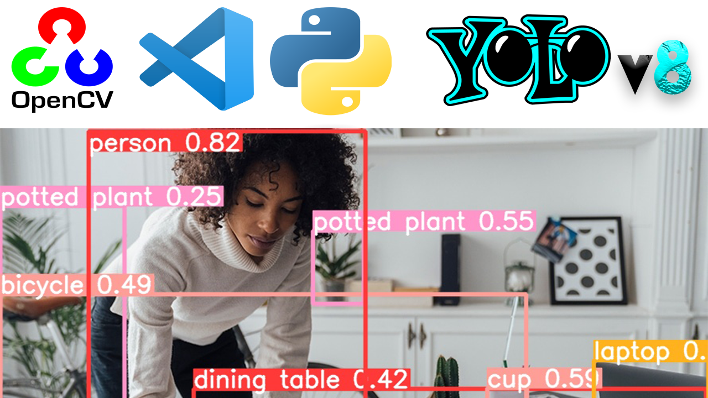

# YoloV8-Silva

The most recent and cutting-edge `YOLO` model, `YoloV8`, can be utilized for applications including object identification, image categorization, and instance segmentation. `Ultralytics`, who also produced the influential `YOLOv5` model that defined the industry, developed `YOLOv8`. Compared to `YOLOv5`, `YOLOv8` has a number of architectural updates and enhancements.



## Silva-Flow

We are simply using `YOLO` models in a python environment with opencv on `Windows`, `Mac` or `Linux` system. It can be imported from the ultralytics module

Two example codes were defined for the module
`yolov8_basics.py` and `yolov8_n_opencv.py`

copyright @ DEPA MSU 2023 | Public

> **Note**
>
> Install requirements.txt file in a Python>=3.7.0 environment, including PyTorch>=1.7

## Installation

```bash
pip install -r requirements.txt
```

> **Note**
>
> For Windows on Git Bash use `source venv/Scripts/activiate`. 

> **Note**
>
> Link to official  [`YoloV8 GitHub page`](https://github.com/ultralytics/ultralytics). Downgrade to opencv-python-4.5.5.64 `pip install opencv-python==4.5.5.64`.


## Using `yolov8_basics.py`

```python
python yolov8_basics.py
```


## Using `yolov8_n_opencv.py`

`Use YoloV8 is an OpenCV way`. Have control over detection on each frame and choose what happens per detection.

```python
python yolov8_n_opencv.py
```


